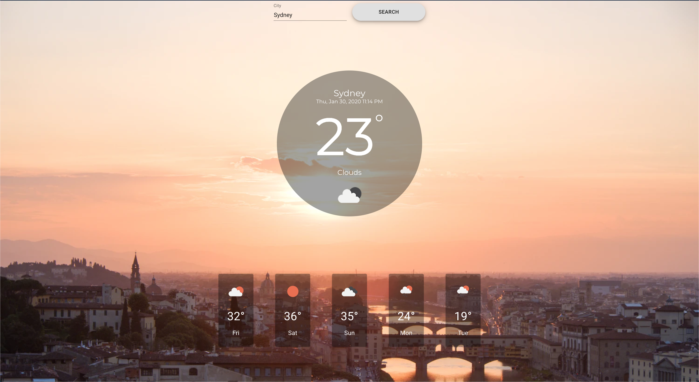

# Weathr

> A short react project to refresh myself on the best practices of api's when used with react

## Table of contents

- [General info](#general-info)
- [Screenshots](#screenshots)
- [Tech Stack](#tech-stack)
- [Setup](#setup)
- [Status](#status)
- [Contact](#contact)

## General info

Weathr is a simple project I put together to improve my understanding of making queries and managing large sets of data. In this project, I utilised OpenWeatherMap API to gather the weather data and injected this data based on the user's city input.

## Screenshots

## Tech Stack

**Languages:** HTML, CSS, Javascript
**Frameworks/Libraries:** React
**Front-end Hosting:** Now  
**Other:** Material-ui

## Setup

1. Clone locally or download a zip file
2. `cd weather-app`
3. `yarn start`
4. Open [http://localhost:3000](http://localhost:3000) to view it in the browser.

You can see the site [here](https://weather-app.shaneenvitug.now.sh/).

## Status

Project is: _in progress_

To-do list:

- [ ] Update background images based on the city a user inputs

## Contact

Created by [@shaneenvitug](https://www.shaneenvitug.com/) - feel free to contact me!
